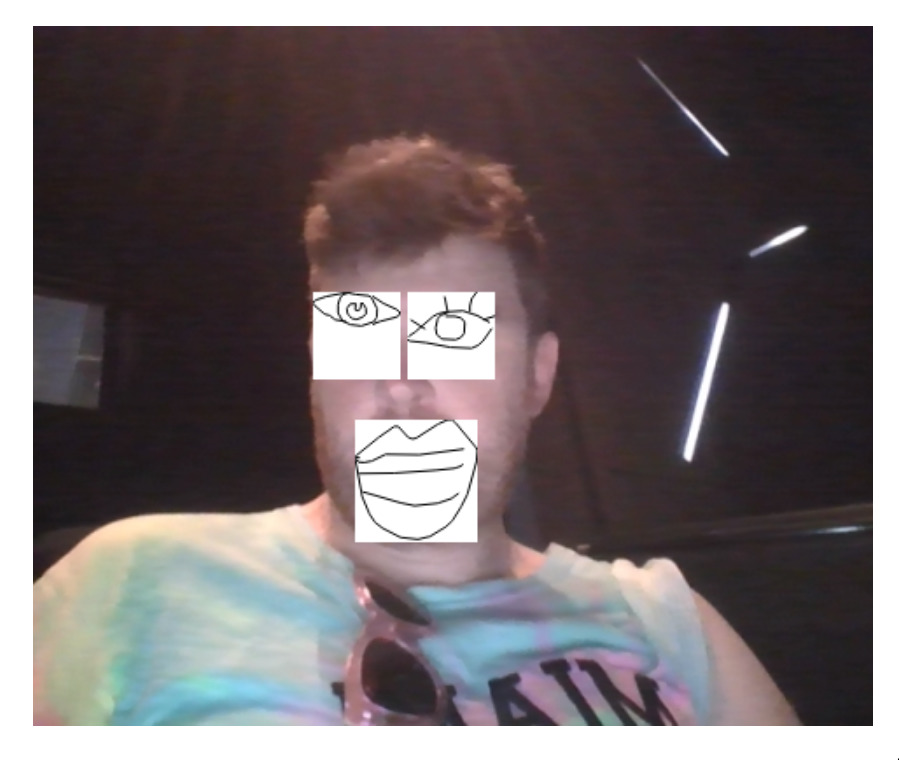

# TensorFlow JS SketchFace




# Setup

```
cd ui
yarn install
```

# Running

In the `ui` folder:

```
python3 -m http.server 8003
```

Then, navigate to <http://localhost:8003/dist/index.html>.


# License

The pose inference model, and associated JavaScript, comes from the
[tfjs-examples](https://github.com/tensorflow/tfjs-examples) repo. See
[here](https://github.com/tensorflow/tfjs-examples/blob/master/LICENSE) for
their license.

This code is Licensed under the [LICENSE](LICENSE).


